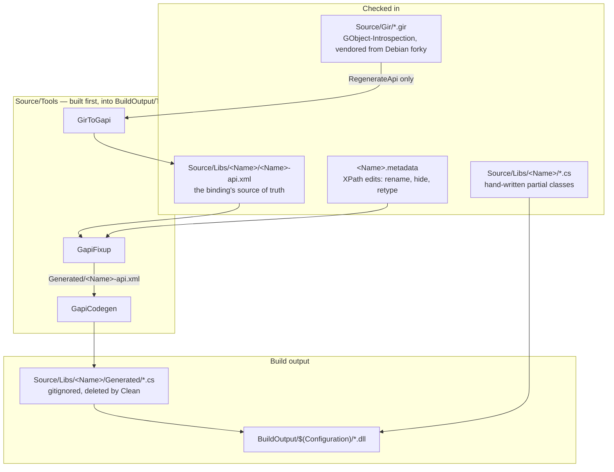
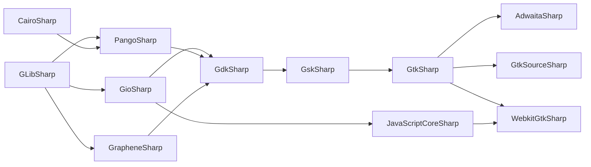

# The architecture of GtkSharp

This describes how the repository is put together and, more usefully, **why** —
the constraints that produced each decision, and what breaks when one is
violated. For how the code is verified, see [testing.md](testing.md); for the
Gtk 3 → Gtk 4 migration itself, [gtk4-upgrade-plan.md](gtk4-upgrade-plan.md).

## The one-paragraph model

GtkSharp is a C# binding for the Gtk 4 stack that **generates almost all of
itself at build time** from XML descriptions of the C API, and reaches the native
libraries by **looking symbols up at runtime** rather than by `DllImport`. Those
two facts explain nearly everything else: why `Generated/` is gitignored, why
`.metadata` files exist, why a missing native function is not a link error, and
why the test suite is the only thing that can tell you the binding works.

---

## Layers



The dashed part of that flow matters: **`RegenerateApi` is not part of a normal
build.** The api.xml files are checked in and edited by review. You run the
converter only when moving to a new Gtk release or changing the converter itself,
and then the diff is the thing to read.

---

## The pipeline, stage by stage

### 1. `.gir` → `api.xml` (`GirToGapi`, on demand)

GObject-Introspection files are the upstream description of the C API. They are
vendored in `Source/Gir/` with provenance and sha256 in `Source/Gir/README.md`,
because the binding must describe *one* known version of Gtk rather than whatever
is installed.

`GirToGapi` replaces `gapi2xml.pl` from the mono era. It is small and its shape
is worth knowing:

| File | Job |
|:--|:--|
| `GirDocument.cs`, `TypeRegistry.cs` | parse, and resolve type names across namespaces |
| `CTypeMapper.cs` | normalise C type spellings into api.xml's vocabulary |
| `CallableEmitter.cs` | methods, constructors, signals, callbacks — parameters, ownership, errors |
| `ObjectEmitter.cs`, `TypeEmitters.cs` | classes, interfaces, records, enums |
| `NameMangler.cs` | `gtk_widget_show` → `Show` |
| `ApiWriter.cs` | serialise |

**This layer is load-bearing and has been wrong.** `CTypeMapper.Normalize` once
collapsed `const char* const*` to `const char*`, losing a level of indirection, so
67 string-array parameters across seven assemblies bound as a single `string`.
`CallableEmitter` once emitted the `throws` *attribute* without the `GError`
*parameter*, so 724 methods had the wrong ABI and no `GException` was ever raised.
Both compiled perfectly.

A converter change must be **reproducible across platforms** — regenerate on
Linux and Windows and diff — or the checked-in api.xml silently becomes whatever
the last machine produced.

### 2. `api.xml` + `.metadata` → fixed-up api.xml (`GapiFixup`)

`GapiFixup` applies the `.metadata` file as XPath-driven edits to a **copy** of
the api.xml in `Generated/`. The vocabulary is small: `attr`, `remove-attr`,
`remove-node`. This is where you rename a member, hide one, change a parameter's
direction or type, mark something deprecated, or make a boxed type non-opaque.

Assemblies with `StrictMetadata` fail the build on a metadata rule that matches
nothing, so rules cannot rot silently as the api.xml changes underneath them.

`GLibSharp` and `CairoSharp` have **no `.metadata` and nothing generated** — they
are hand-written in full. `GLibSharp-api.xml` is a hand-maintained stub that
exists so dependents can `--include` it; Cairo has no real introspection at all
(its gir is a stub of `foreign="1"` records), so it is not even vendored.

### 3. Fixed-up api.xml → C# (`GapiCodegen`)

One generator class per kind of thing, and the names say which:

- `ObjectGen` / `ObjectBase` — GObject subclasses, plus each assembly's
  `ObjectManager` (the GType → managed type registry)
- `InterfaceGen` — a C# interface **plus an `…Adapter`**, because a GInterface
  can be implemented by a type whose class you do not control
- `StructBase` / `NativeStructGen` — value types and their ABI descriptions
- `BoxedGen`, `OpaqueGen` — `GLib.Opaque` subclasses
- `EnumGen`, `CallbackGen`, `Ctor`, `Method`, `Parameter`, `Signal`
- `SymbolTable.cs` — **the C-type → C#-type map**; the first place to look when a
  type comes out wrong everywhere
- `LPGen` / `LPUGen` — native-sized integers

`.csproj` files rely on the SDK's implicit glob, so `Generated/*.cs` compiles
alongside the hand-written files in the same directory. **Never edit anything
under `Generated/`**: `Clean` deletes it and `Prepare` writes it again.

---

## The assembly graph

`CakeScripts/Settings.cake` is the authority. It drives build order, the
`--include=` flags that let codegen resolve cross-assembly types, and per-assembly
codegen flags.



Two placements are deliberate and easy to get wrong:

- **`JavaScriptCoreSharp` comes before `WebkitGtkSharp`.** WebKit's script results
  *are* `JSCValue`s; without the JSC binding first, `script-message-received` can
  only be expressed as a bare pointer.
- **`PangoSharp` binds two gir namespaces** (`Pango` and `PangoCairo`) into one C#
  namespace, via `--group-prefix=pango`. `GdkSharp` does the same for `Gdk` and
  `GdkPixbuf`.

Adding an assembly means touching `Settings.cake`, `Source/GtkSharp.sln`, a new
`Source/Libs/<Name>/`, and — if it binds a new shared library — the `Library` enum
and `GLibrary`'s table.

---

## Native interop: no glue, no `DllImport`

`Source/Libs/Shared/` is linked into **every** wrapper project and is the only
place platform knowledge lives:

- `Library.cs` — an enum of native libraries
- `GLibrary.cs` — enum → candidate filenames per platform, ordered
  `{ windows, linux, macos }`, plus `SetDllDirectory` on Windows
- `FuncLoader.cs` — `LoadLibrary`/`dlopen` and `GetProcAddress`/`dlsym`

Every native call, generated or hand-written, follows one shape:

```csharp
[UnmanagedFunctionPointer(CallingConvention.Cdecl)]
delegate void d_gtk_widget_show(IntPtr raw);
static d_gtk_widget_show gtk_widget_show =
    FuncLoader.LoadFunction<d_gtk_widget_show>(
        FuncLoader.GetProcAddress(GLibrary.Load(Library.Gtk), "gtk_widget_show"));
```

**Do not introduce `[DllImport("gtk-4-1.dll")]`.** It breaks the glue-free,
cross-platform design that is the point of this fork.

Two consequences that have each cost real time:

- **`Gdk`, `Gsk` and `Gtk` all resolve to the same file.** In Gtk 4 they are not
  separate shared libraries.
- **A missing export is a null delegate, not an error.** `FuncLoader.LoadFunction`
  returns `default(T)`, so the binding compiles and throws
  `NullReferenceException` when reached, naming nothing. This is the single most
  important thing about the codebase and is why the test suite exists.
  It also means **the library a symbol is looked up in must be the library that
  exports it** — `g_ptr_array_*` live in GLib, not GObject, and looking for them
  in the wrong one made the whole class unusable.

---

## The type system

### GObject subclasses

`GLib.Object` wraps a `GObject*` and maintains a **static identity map**,
`Dictionary<IntPtr, ToggleRef>`, so one native object is always one managed
wrapper. That invariant is not decoration: two wrappers would each own the object
and the second to finalise would unref something already freed.

`ToggleRef` uses GObject's toggle-reference mechanism to let the GC collect a
wrapper whose only remaining reference is the native one, and to resurrect it if
C hands the pointer back. The map is keyed by address, and **addresses are
reused**, so removal must check that the entry still refers to *this* wrapper —
a lesson learned from an `AccessViolationException` that appeared only under
coverage instrumentation, because instrumentation shifts GC timing.

`GLib.Object.GetObject` manufactures a wrapper if none exists; `TryGetObject` does
not, and so can be asked without side effects.

### Opaques and boxed types

`GLib.Opaque` wraps a pointer whose layout is not exposed, with virtual `Ref`,
`Unref` and `Free` hooks and an `Owned` flag. Boxed types are opaques whose
lifetime GObject manages.

Two open shapes to know about: a boxed type with **no C allocator** cannot be
constructed at all (`new Gsk.RoundedRect()` leaves a null handle and the `Init*`
methods write through it), and `Opaque` has no identity map, so two wrappers over
one handle are possible where `GLib.Object` forbids them.

### Fundamental types

`glib:fundamental="1"` types — `GskRenderNode`, `GdkEvent`, `GtkExpression` — are
`GTypeInstance`s with their own ref/unref rather than GObjects. They are bound on
`GLib.Opaque`. Fifty-seven types across three hierarchies; getting this wrong
makes `GtkSnapshot` drawing unreachable.

### Interfaces

A GInterface becomes a C# `interface` **and** a generated `…Adapter`. The adapter
exists because the implementing type's class may not be ours — the adapter wraps
an arbitrary pointer and dispatches through the interface vtable.

### Structs

Value types are emitted with an `abi_info` describing their native layout field by
field. That description is computed, not assumed, because **`gulong` is 8 bytes on
Linux and 4 on Windows** (LLP64): a struct that hard-codes `sizeof(ulong)` for a
`gulong` field has every subsequent field at the wrong offset on one platform
only.

---

## Signals and marshalling

`GLib.Value` is the boxing layer everything crosses: properties, signal arguments,
list elements. `Value.Val` unboxes to the CLR type the GType stands for — and the
distinction between `int` and `uint` there is not cosmetic, since a `guint` read as
an `int` aborted the process during the Gtk 4 port.

A signal connection is a `SignalClosure` — a real `GClosure` with a managed
marshal callback. The generated `…Args` class exposes the arguments by name off
`Args[i]`.

Two rules fall out of the callback direction:

- **A managed exception cannot cross back into C.** The marshaller hands it to
  `GLib.ExceptionManager`, and the main loop must keep turning afterwards, or one
  bad handler takes the application with it.
- **A signal argument is resolved by GType at runtime**, not by the static type in
  the handler's signature. So an assembly whose signals hand out another
  assembly's types must initialise that assembly's `ObjectManager` — the
  name-based fallback in `GType.LookupType` splits a C name at the second capital
  and cannot cope with an acronym prefix (`JSCValue` → `J.SCValue`).

A managed subclass overrides a virtual method by `OverrideVirtualMethod` at
class-init; `[GLib.DefaultSignalHandler]` marks the pairing.

---

## Where to make a change

In order of preference — reach for the first that can express what you need:

1. **`.metadata`** — renaming, hiding, changing a parameter's direction or type,
   marking deprecated. Cheapest, and survives regeneration.
2. **A hand-written `partial class`** in `Source/Libs/<Name>/` — behaviour codegen
   cannot express. This is the dominant customisation mechanism; see
   `Source/Libs/GtkSharp/Widget.cs`, `Button.cs`, `Application.cs`.
3. **`GapiCodegen`** — when *every* binding of a kind is emitted wrongly. A change
   here is felt across all eleven assemblies at once, which is the point and also
   the risk.
4. **`GirToGapi`** — when the api.xml itself misdescribes the C API. Requires
   `RegenerateApi` and a careful read of the diff.

**Some things the api.xml cannot currently say**, which is worth knowing before
you go looking for the metadata rule that does not exist:

- that a method **consumes its receiver** (`transfer-ownership="full"` on the
  instance parameter) — 51 such functions exist in the vendored girs
- that a `GValue` out-parameter is really an **in/out** the caller must initialise

---

## Packaging

- `Source/Libs/Directory.Build.props` — `net8.0;netstandard2.0`, `LangVersion 9`,
  `AllowUnsafeBlocks`, strong-name signing with `GtkSharp.snk`. **New code must
  compile as C# 9 against both target frameworks.**
- `Source/Workload/` — the .NET `gtk` workload: ref pack, runtime pack, SDK pack
  and manifest, packed once per SDK feature band.
- `Source/Templates/` — standalone `dotnet new gtkapp` templates, independent of
  the workload.
- `Source/Libs/GtkSharp/GtkSharp.targets` — ships inside the NuGet package and, on
  Windows, downloads and unzips a gvsbuild Gtk 4 runtime into
  `%LOCALAPPDATA%\Gtk\4.22.4` unless `SkipGtkInstall=True`. The bundle is a full
  install tree, so the DLLs land in `bin/` with no `lib` prefix — `GLibrary`'s
  `SetDllDirectory` must stay in step with `GtkDir`.

**gvsbuild ships no WebKit.** `WebkitGtkSharp` and `JavaScriptCoreSharp` are
Linux/macOS in practice, which is why those tests skip on Windows and why some
defects can only be found on Linux.

---

## The failure modes this design produces

Everything above buys a glue-free, mostly-generated, cross-platform binding. The
price is a specific set of ways to be wrong, all of which **compile cleanly**:

| Shape | What it looks like |
|:--|:--|
| Missing export | `NullReferenceException` naming nothing, at first call |
| Symbol in the wrong library | the same, but on one platform only |
| Wrong ABI on an out-parameter | stack corruption, or a crash far from the cause |
| Two wrappers over one handle | double free, at collection time, elsewhere |
| A method that consumes its receiver | double free, intermittently, under GC |
| A crash rather than a failure | the run reports "Passed!" with a **lower total** |

That last row is the one to internalise when reading test output: check the
*total*, not the pass count. And when a crash appears to move between runs,
suspect a finalizer before suspecting nondeterminism.
